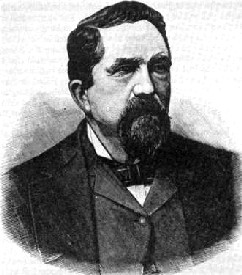
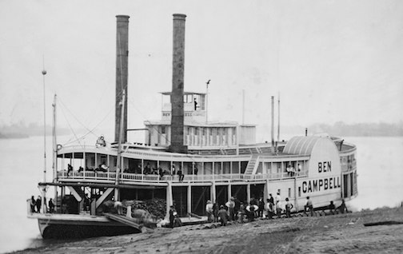

```{r setup, include=FALSE}
library(learnr)
library(googlesheets)
library(dplyr)
library(ggformula)
library(mosaicCore)
library(mosaic)
knitr::opts_chunk$set(echo = FALSE, message=FALSE)
```

```{r read_data}
Cards <- gs_read(gs_key("1i1vGMNPiWiwmsF7kHMBrVAGGv5oUwssfzSYP9O6uqWg"))
Cards <- mutate(Cards, card_symbol = ifelse(card_suit == "spades", '♠', '♥'))
```

## Card sharps on the river

George Devol was a famous riverboat card sharp, playing cards on the boats that carried passengers and freight up- and downstream on the only viable long-distance transportation in the American interior: a riverboat. 

```{r echo = FALSE, fig.align="center", fig.cap="George Devol (1829-1903) [[source]](https://www.legendsofamerica.com/we-georgedevol/)"}

```

We're going to imagine Devol, a real-life character, playing the role of "Colonel" Devol heading upriver on the side-wheel paddle steamer *Ben Campbell*.

```{r echo=FALSE, fig.align="center", fig.cap="A Mississippi riverboat circa 1850. (Source: United States Library of Congress Prints and Photographs division: ID cph.3d02054.)"}

```

## The Riverboat Shuffle

On those long trips upriver, there was nothing much to talk about except how long the journey was. Colonel Devol passes around the cards, asking the people in the boat's saloon to answer two questions about the length of the Mississippi river.

In this activity, you'll see a card trick involving a shuffle.

**Please, if you know the trick, stay quiet until we ask for it to be revealed.**

When you receive a card, **without showing your card to anyone else**, answer the two questions and write your initials at the top of the card. Not having a smoke-filled saloon we're going to use the internet to record your answer and do the fast shuffling by computer. [Here's the spreadsheet for entering your information.](https://docs.google.com/spreadsheets/d/1i1vGMNPiWiwmsF7kHMBrVAGGv5oUwssfzSYP9O6uqWg/edit?usp=sharing)

Once you have entered the card information, tear the card in half along the scissors line. Keep the half with your initials. Trade the upper half with another participant, then do it again with a different participant and so on. Do this as many times as you think necessary to mimic a card shuffle. Then, enter the suit of the card you are holding into your line in the spreadsheet. Repeat this shuffle 4 times altogether, entering the top-half number into the appropriate slot on your line of the spreadsheet.

## Dropping anchor

Unbeknownst to you, Colonel Devol has arranged with the captain to stop the engines and drop anchor. This increases the tension in the saloon. A veritable Hercules Poirot.

Here's Colonel Devol's claim, which he makes once all the cards have been collected and the shuffling done. (In our language, that's after you've entered your data from the original deal and all four shuffles.)

> The card's suit, even though it was dealt randomly, predicts in part your answer to question 2. But once you've torn the card in half and exchanged with other people, the magic connection fails and there's no relationship. 

To demonstrate, Colonel Devol, laid out the answers to question 2 in ascending order, demonstrating the trend from spades to hearts. Almost all the code in the next command block is about making the display pretty.

```{r sort_graph, exercise=TRUE, exercise.setup = "read_data", exercise.cap="A trend?"}
gf_text(1 ~ question2, data = Cards,
          color = ~ card_suit, label = ~ card_symbol,
        size = 20, alpha = 0.5) %>%
  gf_theme(theme_void()) %>% gf_theme(legend.position = "none") %>%
  gf_refine(scale_color_manual(values = c("red", "black")))
```

Laying out cards in a row is an established convention with cards. But statistical data graphics have other conventions:

* Define a response and explanatory variable, putting them on the y- and x-axis respectively.
* Take the axis guides seriously: they convey meaning.

Like this:

```{r standard_graph, exercise=TRUE, exercise.setup = "read_data", exercise.cap="A trend?"}
gf_jitter(question2 ~ card_suit, data = Cards,
          color = ~ card_suit, shape = ~ card_symbol,
        size = 10, alpha = 0.5, width = 0.15) %>%
  gf_theme(legend.position = "none") %>%
  gf_refine(scale_color_manual(values = c("red", "black")),
            scale_shape_identity())
```

Better to start out with the *essential* graphics, which can be made with a concise command:

```{r standard-concise, exercise = TRUE, exercise.setup = "read_data", exercise.cap="Graphics commands don't have to be complicated!"}
gf_jitter(question2 ~ card_suit, data = Cards, width=0.1)
```

## Stopping for t

Colonel Devol died just as William Sealy Gossett was starting his career as a brewer, so he didn't know about the t-statistic. Let's revisit Devol's display using Gossett's t statistic.


```{r analysis, exercise=TRUE, exercise.setup = "read_data", exercise.cap = "Quantifying the relationship."}
t_test(question2 ~ card_suit, data = Cards)
```

* Is the relationship statistically significant?
* Repeat the test, substituting `shuffle_1` for `card_suit`. Do the same for the other shuffles. Does tearing the card break the magic?
* Repeat the test again, using `shuffle(card_suit)` on the right-hand side of the formula.

## Peter Piper picked a peck of p-values

We teach our students about confidence intervals hoping that they come to understand the sense in which the mean is not absolutely precise. But then we calculate p-values, suggesting that they are precise to two decimal places or more. Let's find out.

We'll use two techniques:

* Resampling, to simulate drawing a new sample from the population by sampling from the sample.
* Repetition, to collect a peck of p-values.

```{r peck-of-p, exercise=TRUE, exercise.setup="read_data", exercise.cap="p Precision"}
do(10) * t_test(question2 ~ card_suit, data = resample(Cards))
```

Does this random sample of p-values make you confident that p < 0.05? 

Teacher notes: Here are the cards in [PDF](www/Cards.pdf) and [Keynote](www.Cards.key) form.

